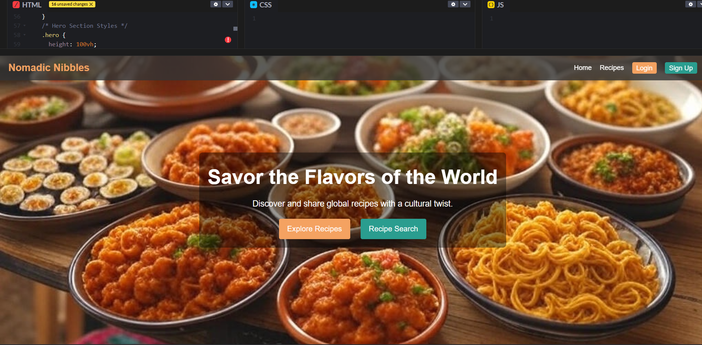
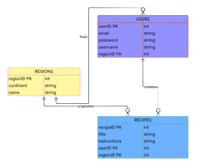

# 🌍 Nomadic Nibbles

---

## 📖 Table of Contents

1. Project Overview  
2. MVP  
3. ERD  
4. Routes and Controllers  
5. Timeline

---

## 🌟 Project Overview

**Nomadic Nibbles** is a vibrant, full-stack recipe-sharing platform designed to unite food lovers across the globe. This project provides an international space for culinary storytelling using relational data models for Users, Recipes, and Regions. The application leverages RESTful routing to offer a seamless experience for creating, managing, and exploring a rich tapestry of global recipes.

---

## 🚀 MVP

1. **User Authentication & Authorization**  
   Secure session-based login and registration ensure that only authenticated users can create, edit, or delete recipes.

2. **Recipe Management**  
   - **Create:** Users can add recipes with fields for title, ingredients, detailed instructions, and cultural region information.
   - **Read:** A dynamic recipe index displays all recipes, with detailed views for each.
   - **Update:** Pre-filled forms allow users to edit their own recipes.
   - **Delete:** Users can remove their recipes to maintain a curated collection.

3. **Regional Focus**  
   - Each user is linked to a specific region, and every recipe is associated with a region, emphasizing cultural origins.

4. **User Interface**  
   Designed with CSS Flexbox and Grid, the UI includes accessible navigation with a persistent header and a responsive layout.

---

## 📊 Entity Relationship Diagram (ERD)

Below is the ERD for **Nomadic Nibbles**, outlining the relationships between Users, Recipes, and Regions.

---

## 🔀 Routes and Controllers

Nomadic Nibbles adheres to RESTful routing conventions. The following table outlines the main routes and their corresponding controllers:

| Route                  | Controller                | Detail                                             |
|------------------------|---------------------------|----------------------------------------------------|
| GET /users/register    | auth.registerForm()       | Renders the registration form                      |
| POST /users/register   | auth.registerUser()       | Processes new user registration                    |
| GET /users/login       | auth.loginForm()          | Renders the login form                             |
| POST /users/login      | auth.loginUser()          | Authenticates user and starts a session            |
| GET /users/logout      | auth.logoutUser()         | Logs the user out and ends the session             |
| GET /recipes           | recipes.index()           | Displays all recipes                               |
| GET /recipes/new       | recipes.renderNewForm()   | Renders form for creating a new recipe             |
| POST /recipes          | recipes.createRecipe()    | Creates a new recipe                               |
| GET /recipes/:id       | recipes.showRecipe()      | Shows details of a specific recipe                 |
| GET /recipes/:id/edit  | recipes.renderEditForm()  | Renders form to edit a recipe                      |
| PUT /recipes/:id       | recipes.updateRecipe()    | Updates a recipe in the database                   |
| DELETE /recipes/:id    | recipes.deleteRecipe()    | Removes a recipe from the database                 |

---

## Timeline

| Day       |   | Task                           | Blockers               | Notes/ Thoughts                          |
|-----------|---|--------------------------------|------------------------|------------------------------------------|
| Monday    |   | Research                       |                        |                                          |
| Tuesday   |   | Proposal & Routes              |                        | Finalize project proposal                |
| Wednesday |   | Views                          | Initial design issues  | HTML & EJS views for core pages          |
| Thursday  |   | Views & Routes                 | Minor debugging        | Express routes                           |
| Friday    |   | Testing                        |                        | Combine functionalities                  |
| Saturday  |   | CSS & Styling                  |                        | Flexbox                                  |
| Sunday    |   | Final review and deploy        |                        |                                          |
| Monday    |   | Present!                       |                        |                                          |

**Savor the flavors of the world with Nomadic Nibbles!**
