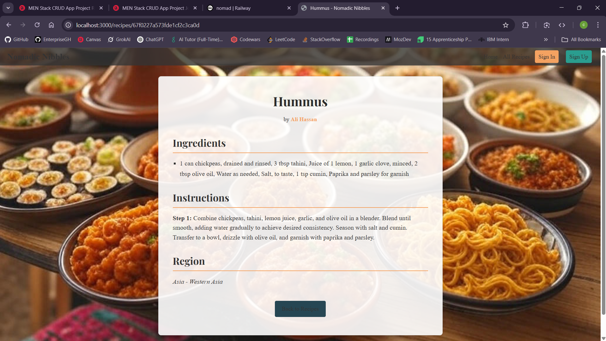

# 🌍 Nomadic Nibbles

## Overview 📖

Nomadic Nibbles is a full-stack, global recipe-sharing platform that brings together food enthusiasts from every corner of the world 🌎. This dynamic application pairs a Node.js/Express web service with a native Android client to deliver a seamless culinary experience 🍽️. With intuitive RESTful routes and a visually engaging interface 🎨, users can easily explore, create, edit, and manage recipes inspired by diverse cultural traditions 🌐.

## Features ✨

- **User Authentication & Authorization 🔒:** Secure, session-based login and registration for personalized experiences.
- **Comprehensive Recipe Management 📝:** Create, view, update, and delete recipes with detailed ingredients and step-by-step instructions.
- **Regional Personalization 🗺️:** Discover recipes tied to specific cultural and geographic regions.
- **Responsive UI 📱:** Enjoy a fluid, accessible interface built with CSS Flexbox and Grid.
- **Integrated Mobile Experience 📲:** Engage with your favorite recipes on the go using the dedicated native Android app.
- **Image Service Integration 🖼️:** Plans to incorporate a dedicated image service to efficiently host and serve recipe images.

## Architecture 💻

### Web Application
- **Backend ⚙️:** Powered by Node.js and Express, offering robust RESTful API endpoints for managing users and recipes.
- **Frontend 🎨:** EJS templates dynamically render responsive HTML views.
- **Static Assets 📁:** All images, stylesheets, and scripts are served from a public directory for seamless performance.

## Tech Stack 🛠️

- **Server 🚀:** Node.js, Express
- **Templating 🖥️:** EJS
- **Styling 🎨:** CSS (Flexbox & Grid)
- **Database 🗄️:** MongoDB (hosted on MongoDB Atlas ☁️)
- **Image Service 🖼️:** Planned integration for optimized image hosting and delivery
- **Version Control 🐙:** Git

## API and Routes 🚦

| HTTP Method | Route                 | Description                                 |
| ----------- | --------------------- | ------------------------------------------- |
| GET         | `/users/register`     | Display the user registration form          |
| POST        | `/users/register`     | Handle new user registration                |
| GET         | `/users/login`        | Display the login form                      |
| POST        | `/users/login`        | Authenticate the user                       |
| GET         | `/users/logout`       | Log the user out                            |
| GET         | `/recipes`            | List all available recipes                  |
| GET         | `/recipes/new`        | Show the form for creating a new recipe     |
| POST        | `/recipes`            | Create a new recipe                         |
| GET         | `/recipes/:id`        | View detailed information for a recipe      |
| GET         | `/recipes/:id/edit`   | Show the form to edit an existing recipe    |
| PUT         | `/recipes/:id`        | Update an existing recipe                   |
| DELETE      | `/recipes/:id`        | Remove a recipe from the platform           |

## Deployment 🚀

The web application is deployed on Heroku ☁️ for scalable, cloud-based hosting. Continuous deployment ensures that updates are automatically pushed and available in production.

## Credits 🤖

This project leverages innovative solutions inspired by AI-generated GPT sources. Contributions and code snippets from various GPT-powered tools have helped shape the development and design of Nomadic Nibbles.

Recipes and user were created by seed file, with original function provided by GA employee and modified using GPT to push 20 different user with 2 different recipes each with one recipe originating from their generate home subregion.

## 🌟Savor the flavors of the world with Nomadic Nibbles🌟Where every recipe tells a unique story!🌟
